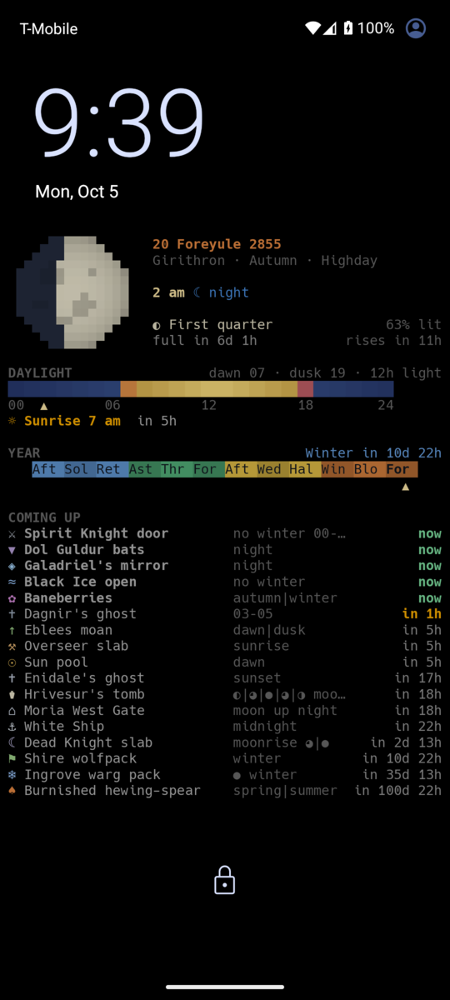
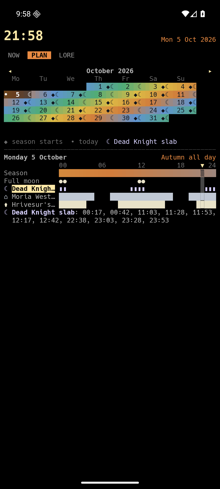
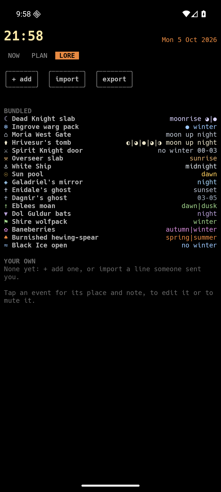

# MUME Almanac

The game time of [MUME](https://mume.org) on your Android lock screen:
the game date and minute, the moon, daylight, the seasons of the year,
and what is coming up (the moon rising, shops opening, seasonal
events). It looks like the almanac in WebCockpit, the browser client.

## In the app

The app shows the same almanac (**NOW**) and two more views:

<table>
<tr>
<td width="50%" valign="top"></td>
<td width="50%" valign="top"></td>
</tr>
<tr>
<td valign="top"><b>PLAN</b>: a calendar of real days, coloured by the
game's season. Under it, the chosen day as a 24-hour timeline: the
season, the full moon and each event's windows. Tap an event to mark
its days in the calendar and list that day's times. Swipe the calendar
to change month.</td>
<td valign="top"><b>LORE</b>: every event and the condition it waits
for (moonrise, night, winter …). Tap one for its place and note. Add
your own, edit or mute the bundled ones, and share them with friends
as a line of text (the same <code>ALM1:</code> format as WebCockpit's
almanac).</td>
</tr>
</table>

This repository holds only the releases. The app is a personal hobby
project, free to use, with no warranty.

## Install

1. On your Android phone (Android 8 or newer), open the
   [latest release](../../releases/latest) and tap
   `mume-almanac-<version>.apk` to download it.
2. Open the downloaded file. Android asks whether your browser may
   install unknown apps: allow it (once).
3. Tap **Install**. If Play Protect warns about an unknown app, tap
   **More details → Install anyway**. (It warns because the app is not
   from the Play Store.)
4. Open **MUME Almanac**. It fetches the game time on its own within a
   few seconds.

## Put it on the lock screen

1. In the app, tap **set lock screen**.
2. You now see your lock screen. Drag the edges so the almanac keeps
   clear of the phone's own clock (top) and shortcuts (bottom).
3. Tap **Set wallpaper**, then choose **Lock screen** (or "Home and lock
   screen") in the phone's preview.
4. If the almanac landed on the home screen too and you would rather
   have a picture there: Settings → Wallpaper → pick an image → Home
   screen. The names differ a little between phones.

The phone's own clock, date and shortcuts draw on top of the almanac.
To keep them out of its way:

- **Pixel and stock Android**: the big clock sits in the middle of the
  lock screen. Pick the small one: Settings → Wallpaper & style → Lock
  screen → Clock size → Small. Then drag the almanac's top edge just
  below the clock.
- **Samsung**: long-press the lock screen to open its editor; there you
  can make the clock smaller and remove widgets and shortcuts.

## Updates

Download and install the newer APK from the releases page; it updates
the app in place and keeps your settings and events. Or let
[Obtainium](https://obtainium.imranr.dev) watch this repository and
update the app for you.

## How it gets the game time

The app reads MUME's public status table (MSSP) at `mume.org:4242`: no
login, no commands, about two short connections a day per phone, plus
a few more on the very first start to find the exact minute. Please
keep it that way: be a good MUME citizen.

## Fonts

The app bundles the [Hack](https://sourcefoundry.org/hack/) and
[DejaVu Sans Mono](https://dejavu-fonts.github.io) fonts under their own
licences: see [`fonts/`](fonts/).
